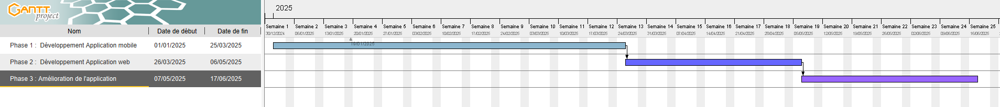

# Memories

Memories est une application web et mobile développée avec Flutter, ayant pour but de permettre aux utilisateurs de créer des albums de souvenirs (photos, vidéos), de collaborer à plusieurs pour les créer, et de pouvoir retrouver ces souvenirs
sur une carte ainsi que dans un calendrier.

# Gantt du projet

